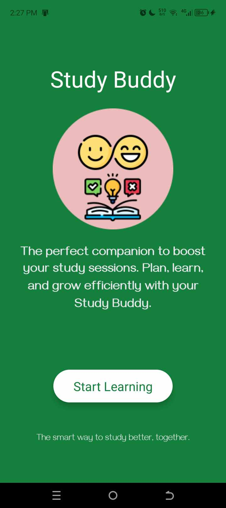
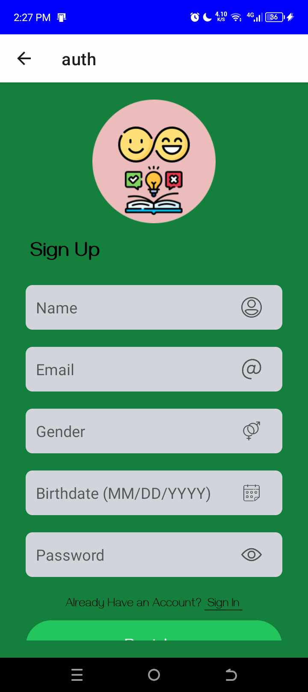
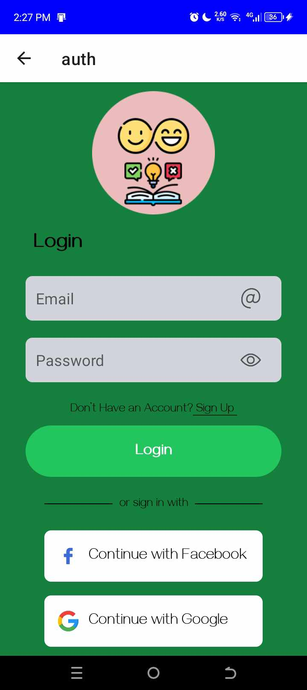
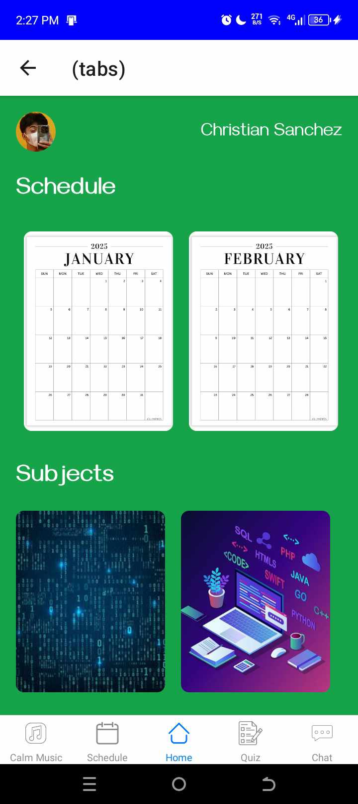

# Study Budd
Study Buddy Mobile App.

# Features
* Scheduler
* • Create and adjust study plans based on your schedule and deadlines.
* Quizzes and Notes
* • Add notes and take quizzes on notes uploaded.
* Chats, send Notes and Quizzes
* • Send updates, send notes and quizzes to your friends.
* Focus Mode
* • Removes distraction from social media notifications and other mobile disturbance
* Music for study session
* • Music and tunes that are good for studying

# Tech Stack
* React Native
* AppWrite
* HTML, CSS and JS

# Home Screen
  

# Sign Up Screen
  

# Sign In Screen
  

# Tabs Screen
  